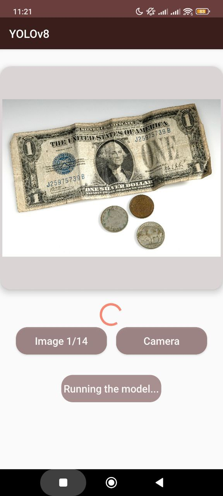
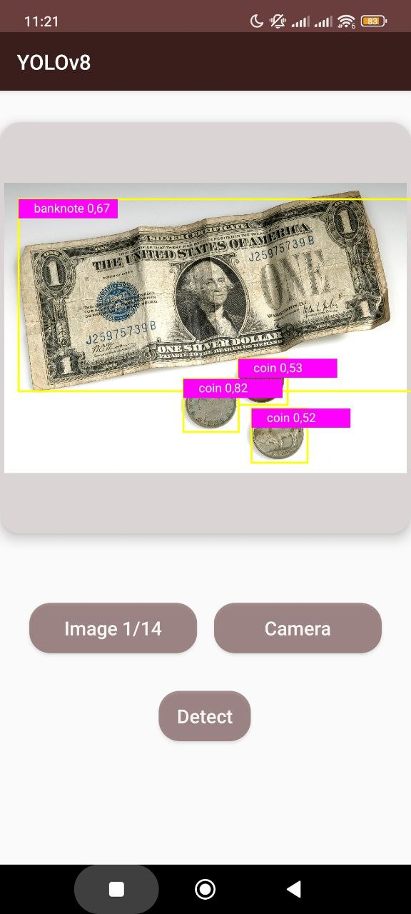
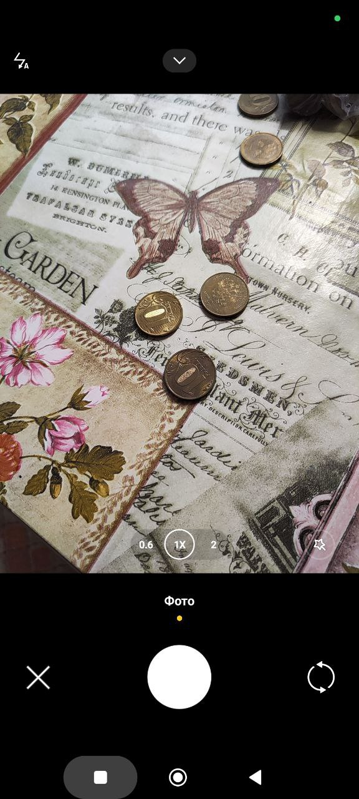
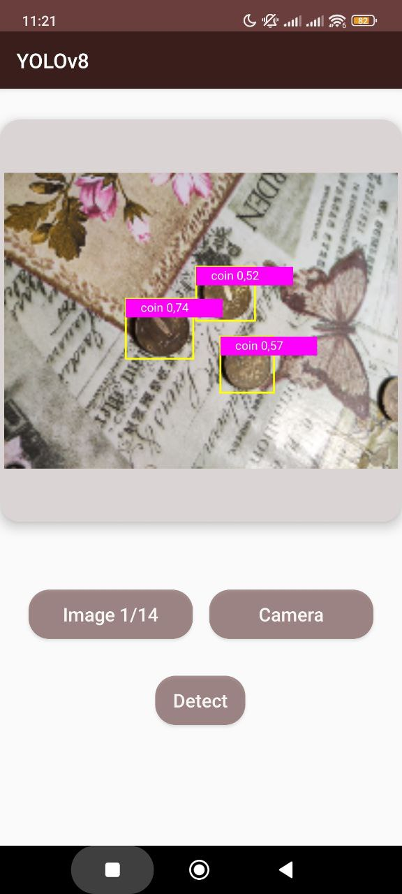

# Object Detection with YOLOv8

## Introduction

The application provides object detection functionality in images using machine learning algorithms. It loads a pre-trained model from the assets folder. First, the model is loaded in TorchScript format, then the input image is processed and converted into a tensor, which is passed to the model for predictions. The detection results are processed and displayed to the user.

This repo allows to train model to classify objects as: coins, banknotes and bank cards

# Dataset Creation and Model Training

In this project, a dataset was manually collected and prepared, which became the foundation for training the model. The process of creating the dataset included several key stages:

## Data Collection

The dataset was gathered from various sources, including images of coins, banknotes, and bank cards.

## Image Annotation

Each image in the dataset was carefully annotated using annotation tools. The annotation involved highlighting objects in the images and assigning them corresponding classes (coins, banknotes, and bank cards).

## Model Training

The model was trained using the **PyTorch YOLOv8** (You Only Look Once) architecture. The model was trained on the annotated dataset.

## Evaluation and Testing

After the training was completed, the model was tested on a separate test dataset to evaluate its performance. Metrics such as accuracy, recall, and F1-score were used to determine how well the model performs the object detection task.

## Optimization

Based on the testing results, additional iterations of model optimization were conducted, including hyperparameter tuning and fine-tuning on more challenging examples, which allowed for achieving even higher results.

# Android application
## Taking Image from assets
 


## Taking Picture from Camera
 

## Libraries
### AndroidX Libraries:
```androidx.camera:camera-view:1.4.2```: A library that simplifies the integration of camera functionality into Android applications, providing a straightforward API for capturing images and video.

### CameraX Libraries:

```androidx.camera:camera-core:1.4.2```: The core library for CameraX, providing the foundational components for camera functionality.
```androidx.camera:camera-camera2:1.4.2```: Integrates the Camera2 API with CameraX, allowing developers to leverage the advanced features of the Camera2 API while using the simplified CameraX API.
```androidx.camera:camera-lifecycle:1.4.2```: Manages the lifecycle of the camera, ensuring that the camera is properly opened and closed in accordance with the activity or fragment lifecycle.

### PyTorch Libraries:

```org.pytorch:pytorch_android_lite:1.13.1```: A lightweight version of the PyTorch library for Android, enabling the use of machine learning models for inference on mobile devices. This library allows developers to run pre-trained models efficiently on Android.
```org.pytorch:pytorch_android_torchvision_lite:1.13.1```: Provides additional functionalities for image processing and computer vision tasks, complementing the core PyTorch library. This library includes utilities for working with image data, making it easier to preprocess images for model inference.


## Main Code Components for Image Detection

### Loading the Model
```java 
mModule = LiteModuleLoader.load(MainActivity.assetFilePath(getApplicationContext(), "best.torchscript"));
``` 
Here, the PyTorch model saved in TorchScript format is loaded. The model file is named best.torchscript and should be located in the application's assets folder.

### Loading Object Classes
```java
BufferedReader br = new BufferedReader(new InputStreamReader(getAssets().open("money_classes.txt")));
String line;
List<String> classes = new ArrayList<>();
while ((line = br.readLine()) != null) {
    classes.add(line);
}
PrePostProcessor.mClasses = new String[classes.size()];
classes.toArray(PrePostProcessor.mClasses);
```
This section reads the file money_classes.txt, which contains the names of the object classes that the model can recognize. These classes are stored in the array PrePostProcessor.mClasses.

### Image Processing
```java
Bitmap resizedBitmap = Bitmap.createScaledBitmap(mBitmap, PrePostProcessor.mInputWidth, PrePostProcessor.mInputHeight, true);
final Tensor inputTensor = TensorImageUtils.bitmapToFloat32Tensor(resizedBitmap, PrePostProcessor.NO_MEAN_RGB, PrePostProcessor.NO_STD_RGB);
```
The image (mBitmap) is resized to the input dimensions expected by the model (defined in PrePostProcessor.mInputWidth and PrePostProcessor.mInputHeight). Then, the image is converted into a floating-point tensor that will be used in the model. NO_MEAN_RGB and NO_STD_RGB indicate that normalization is not applied.

### Running the Model for Predictions
```java
IValue outputTuple = mModule.forward(IValue.from(inputTensor));
final Tensor outputTensor = outputTuple.toTensor();
final float[] outputs = outputTensor.getDataAsFloatArray();
```
The model is run with the input tensor, and the result is returned as an IValue. The result is converted into a tensor, and the data is extracted into the outputs array, which contains the detection results.

### Processing Results
```java
final ArrayList<Result> results = PrePostProcessor.outputsToNMSPredictions(outputs, mImgScaleX, mImgScaleY, mIvScaleX, mIvScaleY, mStartX, mStartY);
```
The detection results are processed using the outputsToNMSPredictions function, which likely performs post-processing, including non-maximum suppression (NMS) to filter overlapping predictions. Parameters such as mImgScaleX, mImgScaleY, mIvScaleX, mIvScaleY, mStartX, and mStartY are used for scaling and positioning the results on the original image.

### Updating the User Interface
```java
runOnUiThread(() -> {
    mButtonDetect.setEnabled(true);
    mButtonDetect.setText(getString(R.string.detect));
    mProgressBar.setVisibility(ProgressBar.INVISIBLE);
    mResultView.setResults(results);
    mResultView.invalidate();
    mResultView.setVisibility(View.VISIBLE);
});
```
After the analysis is complete, the results are passed to ResultView, which updates the display of results on the screen.

# How to use
Download code and open PowerShell inside folder. To build docker use:
```
docker build -t docker-yolo .
```

For training model use:

```
docker run --rm -it -v .\money_dataset:/usr/yolo_v8_app/datasets/money_dataset -v .\results:/usr/yolo_v8_app/results docker-yolo python3 train.py
```

For validation use:

```
docker run --rm -it -v .\money_dataset:/usr/yolo_v8_app/datasets/money_dataset -v .\results:/usr/yolo_v8_app/results docker-yolo python3 val.py
```
